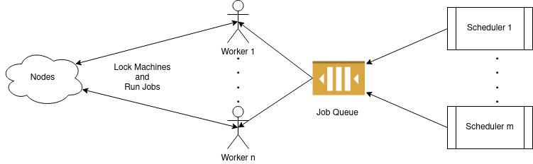
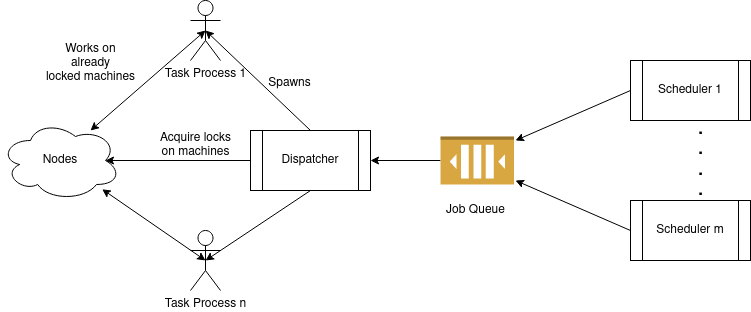

# CEPH GSOC PROPOSAL: SHUBHAM MISHRA

***Teuthology Scheduling Improvements***

**Mentors**: Josh Durgin and Neha Ojha

## Basic Information

- **Name**: Shubham Mishra

- **City**: [Suri, West Bengal](https://en.wikipedia.org/wiki/Suri,_Birbhum)

- **Country**: India

- **Time Zone**: Asia/Kolkata (UTC+5.5)

- **Email Address**: smishra99.iitkgp@gmail.com

- **Github Handle**: [grapheo12](https://github.com/grapheo12)

### Personal Background

I am a $2^{nd}$ year undergraduate student from the Department of Computer Science and Engineering, [IIT Kharagpur](https://www.iitkgp.ac.in).
My primary programming language is Python. I have been programming in it for the last 5 years.
Besides, I am comfortable with C/C++, JavaScript and basic Java.

I have interest in Distributed Systems. This is one of the reasons why I chose Ceph for GSoC.

I have been actively contributing to Open Source Projects since 2018.
As an Executive of [Kharagpur Open Source Society](https://kossiitkpg.org), I promote Open Source Culture in my campus by different workshops and events.

## Project Overview

### Project Description

#### Abstract

The project aims to replace the current multiple worker model for running tests
to a single dispatcher mechanism.

#### Details

[Ceph](https://ceph.io) is a unified, distributed storage system designed for excellent performance, reliability and scalability.
Ceph has an extensive testing framework called [Teuthology](https://github.com/ceph/teuthology).
Teuthology attempts to solve the problem of testing in a highly distributed and scalable setup.

Currently, tests are run by Teuthology in the following way: A [Beanstalk](https://kr.github.io/beanstalkd/) priority queue is kept for the jobs.
For testing, `teuthology-schedule` command is run with a designated job to run (see the [QA suites](https://github.com/ceph/ceph/tree/master/qa).
This schedules the job in the queue. Multiple worker processes are then run, which consume these jobs from the queue and run the job processes.

These worker nodes compete against each other, to get a lock on the number of nodes required for the jobs they are running.
This means that the jobs with lower priority often starve. This creates problems at scale.

The aim of my project is to replace this multiple worker mechanism to a single dispatcher.
This dispatcher will walk through the jobs in the queue, fairly allocate them with the required amount of nodes and run them.

Presently, workers can be left waiting in case of unavailability of machines, thereby consuming resources.
The proposed dispatcher will solve this issue by eliminating the competition.

**Implementation of the Scheduler**

A variety of job scheduling algorithms can be tested out with the dispatcher (for example, those discussed [here](https://www.os-book.com/OS9/slide-dir/PPT-dir/ch6.ppt)). One proposed idea is as follows:

The jobs have already have a priority $p$.
We can readjust the priority by introducing a micro-parameter $\delta p$ based on its node requirements.

The absolute priority, $P = p + \delta p$

This parameter $\delta p$ can be governed by demand of the requested node or the usual time required for the suite to finish.

This will ensure that higher priority jobs run at first.
At the same time, amongst jobs with same priority, it will ensure lighter jobs to be executed early, freeing resources as early as possible.

The dispatcher will also stop and bury jobs that have not responded within a predefined threshold time.

Currently, low priority jobs can be starved by a stream of high priority jobs. A stretch goal for the project is to implement an algorithm
so that this does not happen. In this regard, the dispatcher can periodically increase the priorities $P$.

**Locking Mechanism**

Teuthology already has an elaborate mechanism to lock machines.
It is run by the workers before starting of tasks.
It would be best if the same locking mechanism is put into action by the dispatcher.

The solution is that after a schedule of jobs is formed, the dispatcher will maintain a sequence of locks to perform for each task.
Then it can use the existing locking mechanism to lock and unlock machines according to the sequence.
A second task can be allowed to run parallely if the set of nodes required by them can be made disjoint.
Else it needs to wait for clearance.

**One worker vs Dispatcher model**

Apparently, it may seem that the problem discussed above can be solved by having only one worker.
But this is not the case due to the following:

1. A worker typically runs a single task, whereas the dispatcher must schedule all the tasks in the queue.

2. Even if worker is made capable of running multiple tasks, it will perform it sequentially.
The dispatcher, by scheduling jobs such that adjancent jobs have the least number of conflicting resources,
can achieve high level of parallelism.

**Pulpito Integration**

[Pulpito](https://github.com/ceph/pulpito) is the web app interface for Teuthology.
Currently, it shows the status of the Beanstalk Queue.

Endpoints for handling the dispatcher (displaying current schedule, lock status etc.) must be integrated with Pulpito.

**Testing of features**

Each change I introduce to the existing system will be extensively tested.
I propose to create a fixed set of fake jobs that can be used to benchmark the dispatcher scheduling algorithms
against the current worker models.
Benchmarking criteria will include time to complete the full list of jobs
and average number of jobs running parallely.

### Communication with mentors

I have communicated to my mentors over a mail thread and IRC over the last month.
The mentors had given me a list of tasks which I have duly completed.
The tasks were:

1. Cloning the Teuthology repository.

2. Going through the [docs](https://docs.ceph.com/teuthology/docs/README.html) to understand the basics.

3. Inspecting the code to find how scheduling and dequeing of jobs are done.

4. Suggesting high level improvements to the code.

5. Reading about Ceph integration testing using Teuthology and the structure of the suites.

### Contribution

- [Open]
[https://github.com/ceph/teuthology/pull/1432](https://github.com/ceph/teuthology/pull/1432)

### Project Timeline

1. **Pre-Community Bonding Period**:

    - Exploring the code-base more, to get acquainted with the all the minor details of the project.
    - Submitting a few patches and solving a few issues.

2. **Community Bonding Period**:

    I prefer bonding with the community over code.
    Since my institute's exams would be over by then, I will have a lot of time at hand.
    Hence I'll divide this phase into 2 parts:

    2a. [May Week 1-2]:
	- Submitting more patches.
	- Setting up development environment to run tests.
	- Engaging in discussion over algorithms to be implemented with the community  over IRC and Email.

    2b. [May Week 3-4]:
	- Finding already available open-source implementations of the selected algorithms.
	- Coding up samples of the scheduling of the dispatcher and benchmarking them.

3. **June Week 1-2**:
    
    - Implementing the selected scheduling algorithms.
    - Make dry-runs of the just scheduling of jobs to ensure everything is working as expected.
    - Creating a fake set of jobs for testing purpose.

4. **June Week 3-4**:

    - Implementing output of order of machine locks by the dispatcher.
    - Using the existing APIs to perform actual locks on the machines.
    - Testing and becnhmark overall scheduling and locking flow.

----------- [Phase 1 Evaluation] --------------

5. **July Week 1-2**:
    
    This 2 weeks will be dedicated to integration of the works done in previous two weeks.
    
    - Implementing overall integration to the master code-base.
    - Writing unit-tests for all the modules integrated.
    - Running extensive tests with a set of fake jobs to check how the system performs in real-life.
    - Document the changes made.

6. **July Week 3-4**:

    - Implement reprioritizing jobs. (This is a stretch goal of the project. So it is done after major parts of the main deliverables are completed.)
    - Modifying the unit-tests and run test this feature on afore-mentioned fake set of jobs.

------------- [Phase 2 Evaluation] ----------------------

7. **August Week 1-2**:
    
    This 2 weeks will primarily focus on integrating the dispatcher functions with Pulpito Dashboard.
    Besides writing of the documentation will be completed within this period.

8. **August Week 3-4**:

    This 2 weeks are kept as a buffer period to compensate for any unprecendented delay.
    This can also be utilized for exploring further improvements in the projects if my mentors want the same.

------------ [Final Evaluation] ------------------------
    

## Open Source Contributions/Projects

As I have already discussed with my mentors, there are a few open source projects related to the task and the language (Python) with which I have to work on the project. Mentionworthy among them are:

-  [https://github.com/grapheo12/atlan-task](https://github.com/grapheo12/atlan-task): This is a file upload/export server where uploads can be stopped in the midway by externally firing another request.

- [https://github.com/iit-technology-ambit/Midgard](https://github.com/iit-technology-ambit/Midgard): This is Continuous Deployment bot built from scratch.

- Minor documentation improvement in Scipy: [https://github.com/scipy/scipy/pull/11499](https://github.com/scipy/scipy/pull/11499)
